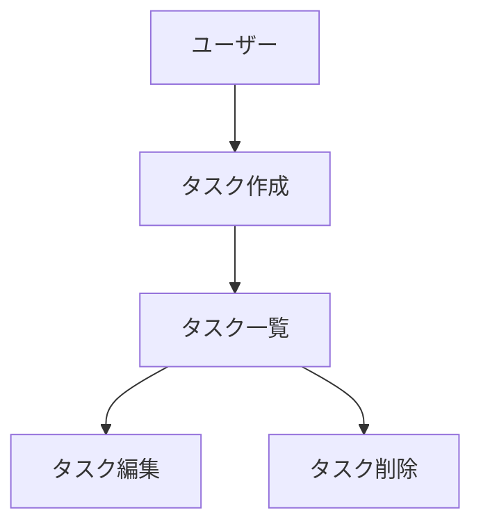

# 図表・ダイアグラムの記載ルール

`/dev-docs` の参照資料。永続的ドキュメントに図表を書くときの配置と記述形式。

設計図やダイアグラムは、関連する永続的ドキュメント内に直接記載し、手間を最小限に抑える。
独立した diagrams フォルダは作成しない。

**配置例:**

- ER図、データモデル図 → `functional-design.md` 内に記載
- ユースケース図 → `functional-design.md` または `product-requirements.md` 内に記載
- 画面遷移図、ワイヤーフレーム → `functional-design.md` 内に記載
- システム構成図 → `functional-design.md` または `architecture.md` 内に記載

## 記述形式

1. **Mermaid記法(推奨)**
  - Markdownに直接埋め込める
  - バージョン管理が容易
  - ツール不要で編集可能



2. **ASCIIアート**
  - シンプルな図表に使用
  - テキストエディタで編集可能

```
┌─────────┐
│ Header  │
└─────────┘
     │
     ↓
┌─────────┐
│Task List│
└─────────┘
```

3. **画像ファイル(必要な場合のみ)**
  - 複雑なワイヤーフレームやモックアップ
  - `docs/images/` フォルダに配置
  - PNG または SVG 形式を推奨

## 図表の更新

- 設計変更時は対応する図表も同時に更新
- 図表とコードの乖離を防ぐ
- 図表は必要最小限に留め、メンテナンスコストを抑える
